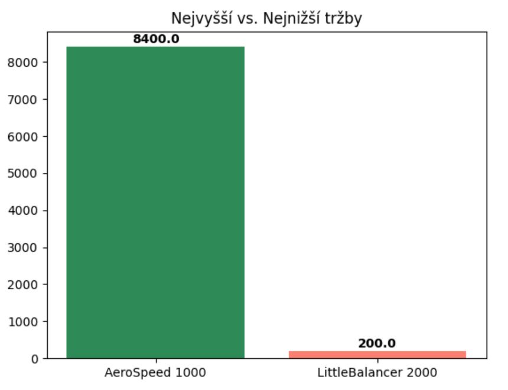
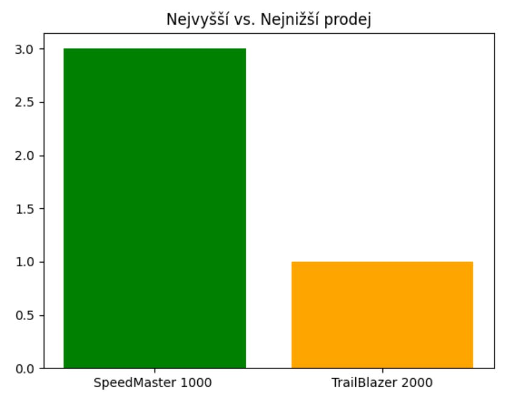

🐍📊 Sales Data Analysis / Analýza prodejních dat

This project demonstrates a basic sales dataset analysis with Python using pandas for data manipulation and matplotlib for visualization.
Tento projekt ukazuje základní analýzu prodejních dat v Pythonu s využitím pandas pro práci s daty a matplotlib pro vizualizace.

Cílem projektu je procvičit si základní práci s daty – od načtení CSV souboru, přes filtrování a vyhledávání klíčových metrik, až po jednoduché grafy.

📂 Project Structure / Struktura projektu

sales_analysis.ipynb → Jupyter notebook (exploration, filtering, analysis, visualization)

app.py → clean Python script with analysis (ready to run)

Sales.csv → dataset (input data)

img/ → exported plots / exportované grafy (.png)

🧾 Data Overview / Popis dat

The dataset Sales.csv contains transactional sales data with columns:
Dataset Sales.csv obsahuje transakční data se sloupci:

Product Name, Product Category, Product Subcategory

Order Quantity, Order Total, Product Price

Payment Method, Order Date, Order Status, Customer ID

🔹 Sample Data Preview / Ukázka dat
Product Name          Product Category   Order Quantity   Order Total   Product Price   Payment Method
------------------------------------------------------------------------------------------------------
Endurain Enduraille   Road Bike          1                2600          2600            Credit Card
LittleBalancer 1000   Kids Bike          2                 400           200            Credit Card
LittleBalancer 2000   Kids Bike          1                 200           200            Paypal
SpeedMaster 1000      Mountain Bike      3                4500          1500            Credit Card
AeroSpeed 1000        Road Bike          2                8400          4200            Paypal

(Data jsou fiktivní, vytvořená pouze pro účely cvičení.)

🔑 Analysis Workflow / Postup analýzy

Data exploration / Průzkum dat

Preview (head, columns, index)

Filtering by product price, quantity, payment method

Kontrola unikátních kategorií produktů

Business metrics / Klíčové metriky

Identification of:

Top revenue product / Nejvyšší tržby (idxmax on Order Total)

Lowest revenue product / Nejnižší tržby (idxmin on Order Total)

Top selling product by quantity / Nejvyšší prodej podle množství)

Lowest selling product / Nejnižší prodej

## 📈 Visualizations / Vizualizace
### Revenue Comparison / Porovnání tržeb

### Sales Comparison / Porovnání prodejů

📊 Key Results / Hlavní výsledky
| Metric / Metrika                                 | Product / Produkt   | Value / Hodnota |
| ------------------------------------------------ | ------------------- | --------------- |
| **Highest revenue / Nejvyšší tržby**             | AeroSpeed 1000      | **8400 CZK**    |
| **Lowest revenue / Nejnižší tržby**              | LittleBalancer 2000 | **200 CZK**     |
| **Top sales volume / Nejvyšší prodej (kusy)**    | SpeedMaster 1000    | **3 units**     |
| **Lowest sales volume / Nejnižší prodej (kusy)** | TrailBlazer 2000    | **1 unit**      |

📈 Visualizations / Vizualizace
Revenue Comparison / Porovnání tržeb

Sales Comparison / Porovnání prodejů

💻 Example Code / Ukázka kódu
🔹 Data Exploration & Filtering / Průzkum a filtrování
import pandas as pd

# Load dataset
df = pd.read_csv("Sales.csv", sep=";")

# Basic preview
print(df.head())
print(df.columns)

# Filtering example: expensive products paid by Credit Card
filtered = df[(df["Product Price"] > 5000) & (df["Payment Method"] == "Credit Card")]
print(filtered[["Product Name", "Product Price", "Payment Method"]])

🔹 Business Metrics / Klíčové metriky
# Top revenue product
top_revenue = df.loc[df["Order Total"].idxmax(), ["Product Name", "Order Total"]]

# Lowest revenue product
low_revenue = df.loc[df["Order Total"].idxmin(), ["Product Name", "Order Total"]]

# Top sales volume
top_sales = df.loc[df["Order Quantity"].idxmax(), ["Product Name", "Order Quantity"]]

# Lowest sales volume
low_sales = df.loc[df["Order Quantity"].idxmin(), ["Product Name", "Order Quantity"]]

🔹 Visualization / Vizualizace
import matplotlib.pyplot as plt

# Top vs. low revenue chart
products = [top_revenue["Product Name"], low_revenue["Product Name"]]
values = [top_revenue["Order Total"], low_revenue["Order Total"]]
colors = ["seagreen", "salmon"]

plt.bar(products, values, color=colors)
plt.title("Nejvyšší vs. Nejnižší tržby")
for i, v in enumerate(values):
    plt.text(i, v + 100, str(v), ha="center", fontsize=10, fontweight="bold")
plt.savefig("img/top_vs_low_revenue.png")
plt.show()

▶️ How to Run / Jak spustit
1 Clone the repository / Naklonujte si repozitář:
git clone https://github.com/<your_name>/<repo_name>.git
cd <repo_name>

2 Install required libraries / Nainstalujte knihovny:
pip install pandas matplotlib

3 Run the notebook or script / Spusťte notebook nebo skript:
jupyter notebook sales_analysis.ipynb

or/nebo

python app.py

4 Dataset Sales.csv is included / Dataset Sales.csv je součástí projektu.

🛠 Tools & Libraries / Nástroje

Deepnote → cloud environment for notebooks / cloudové prostředí pro notebooky

Python 3.10 → programming language / programovací jazyk

pandas → data manipulation / práce s daty

matplotlib → visualization / vizualizace

🚀 What I Learned / Co jsem se naučila

Practical usage of idxmax and idxmin for identifying key records

Combining pandas and matplotlib for clear visual outputs

Creating custom filters (e.g. price + payment method)

Adding annotations and styling to charts

Zvládnutí základů Pythonu pro datovou analýzu – krok po kroku, bez přeskakování

🔮 Future Work / Další kroky

Time series analysis of orders / Analýza objednávek v čase

Grouping by product category and payment method / Seskupování podle kategorií a platební metody

Average product prices and customer segmentation / Průměrné ceny a segmentace zákazníků

📜 Copyright

© 09/2025 by Denisa
(využívám poznatky z kurzů Python for Everybody od Michigan University přes Coursera a také poznatky z kurzu DaPython od PyLadies).
